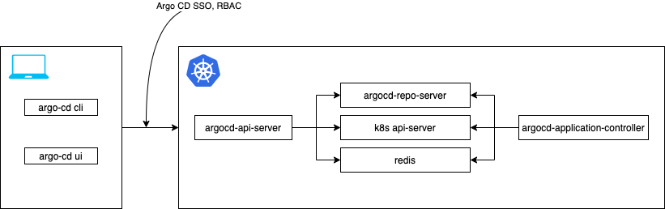
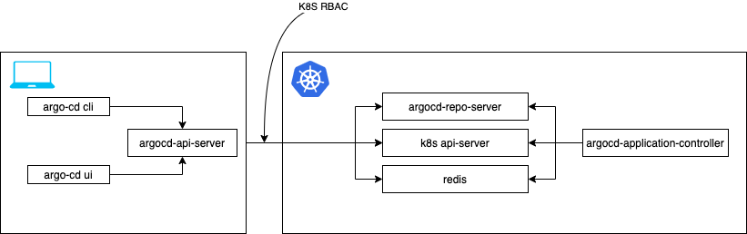

## Argo CD Headless

* Problem
* Proposal
* Demo


---

## Problem - Not everyone needs Argo CD multi-tenancy features.
 
* Users have to deal with passwords and accounts in order to try Argo CD.
* There is no easy way to manage Argo CD without exposing API outside of the cluster.



---

## Proposal - Argo CD Headless

* Proposal: https://github.com/argoproj/argo-cd/pull/6385
* Implementation: https://github.com/argoproj/argo-cd/pull/6361



---

### Details

* Introduce "headless" installation manifests.
* The `argocd` CLI can talk directly to Kubernetes. (e.g. `argocd app list --headless`)
* The Argo CD UI is avaiable using `argocd admin dashboard` command.
* The `argocd-util` is merged into `argocd admin` (e.g. `argocd admin app generate-spec`).

---

# Demo

```
kubectl create ns argocd
kubectl apply -f manifests/headless-install.yaml -n argocd
argocd login --headless
argocd app list

kubectl rollout status deploy/argocd-repo-server
argocd app create guestbook \
    --repo https://github.com/argoproj/argocd-example-apps \
    --path guestbook \
    --dest-server https://kubernetes.default.svc \
    --dest-namespace default
```

---

# Questions

Please ask now or comment in https://github.com/argoproj/argo-cd/pull/6385

* Do we need namespaced headless Argo CD?
* Do we need a better name for the feature?