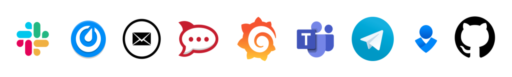

## Notifications Engine

https://github.com/argoproj/notifications-engine


---

## Integrates with multiple notifications services



---

## Configuration driven

```yaml
apiVersion: v1
kind: ConfigMap
metadata:
  name: argocd-notifications-cm
data:
  trigger.on-sync-status-unknown: |
    - when: app.status.sync.status == 'Unknown'
      send: [app-sync-status]

  template.app-sync-status: |
    message: |
      Application {{.app.metadata.name}} sync is
      status is {{.app.status.sync.status}}.

  service.slack: |
    token: $slack-token
```

---

## Friendly end-user experience

```yaml
apiVersion: argoproj.io/v1alpha1
kind: Application
metadata:
  annotations:
    notifications.argoproj.io/subscribe.on-sync-succeeded.slack: |
        my-channel1;my-channel2
```

---

## Demo

Notifications for Cert Manager

```bash
git clone git@github.com:argoproj/notifications-engine.git
cd notifications-engine
kubectl apply -f ./examples/certmanager/config.yaml
kubectl create secret generic cert-manager-notification-secret --from-literal slack-token=<SLACK-TOKEN>
go run examples/certmanager/controller/main.go
```

---

## Links

* Project repository: https://github.com/argoproj/notifications-engine
* This presentation: https://github.com/alexmt/presentations/tree/master/argocd-community/6-2-2021
* Demo: https://github.com/argoproj/notifications-engine/tree/master/examples/certmanager