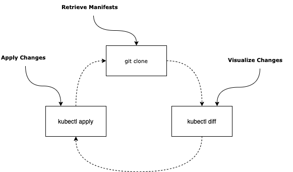
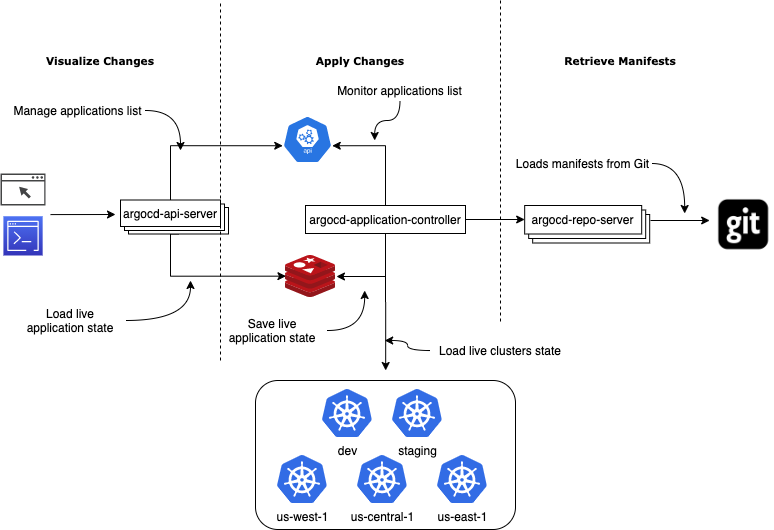

# Argo Contributor Experience

## Argo CD

* Architecture overview
* Development environment setup
* How to triage "first good issues" to get started


---

# GitOps Operator

* **Retrieve Manifests** Clone Git repository, run config management tool such as Helm or Kustomize.
* **Visualize Deviations** Compare manifests with live resources in K8S cluster.
* **Apply Changes** Push updated manifests to K8S cluster.



---

# Argo CD Architecture



* **Retrieve Manifests**
  `argocd-repo-server`
* **Visualize Deviations**
  `argocd-server`
* **Apply Changes**
  `argocd-application-controller`

---

# Argo CD On Your laptop

[Developer guide](https://argoproj.github.io/argo-cd/developer-guide/running-locally/)

* [golang](https://golang.org/doc/install)
* [docker](https://www.docker.com/get-started)
* kubernetes ([minikube](https://minikube.sigs.k8s.io/), [k3s](https://k3s.io/)) + [kubectl](https://kubernetes.io/docs/tasks/tools/install-kubectl/)
* optionally: [kustomize](https://kustomize.io/), [helm](https://helm.sh/)

---

# Configure Your Cluster

* CustomResourceDefinitions: **Application**, **AppProject**
* ConfigMaps: **argocd-cm**, **argocd-rbac-cm**, **argocd-gpg-keys-cm**, **argocd-tls-certs-cm**, **argocd-ssh-known-hosts-cm**
* Secrets: **argocd-secret**

```
kustomize build test/manifests/base/ | kubectl apply -f -
```

---

# Run Components

**Option 1**

Run everything in Docker: `make start`. Simplest way to get started but slower
(especially on Mac/Windows). More details in
[developer guide](https://argoproj.github.io/argo-cd/developer-guide/running-locally/#start-local-services)

**Option 2**

Run all components manually and use [goreman](https://github.com/mattn/goreman) to make it easier.

* Install `goreman` `go get github.com/mattn/goreman`
* Start everything: `goreman start`
* Start components one by one `goreman start api-server repo-server controller`

---

# Configure your IDE

* Use `goimports -local github.com/argoproj/argo-cd -w $FilePath$`
* Use [Procfile](https://github.com/argoproj/argo-cd/blob/master/Procfile) to run components from your IDE
* Magic environment variables:
  `ARGOCD_FAKE_IN_CLUSTER` - switches https://kubernetes.default.svc to your cluster
  `ARGOCD_TLS_DATA_PATH`, `ARGOCD_SSH_DATA_PATH` - teaches repo-server to load certs from local folders

---

# First good issues

* `good first issue` label: https://github.com/argoproj/argo-cd/issues?q=is%3Aopen+is%3Aissue+label%3A%22good+first+issue%22
* filter using `component:<name>` labels: `api`, `applications-set`, `audit`, `cli`, `config-management`, `core`, `distribution`, `git`, `multi-cluster`, `multi`-tenancy `rbac` `settings` `sso` `third-party-k8s`, `ui` 